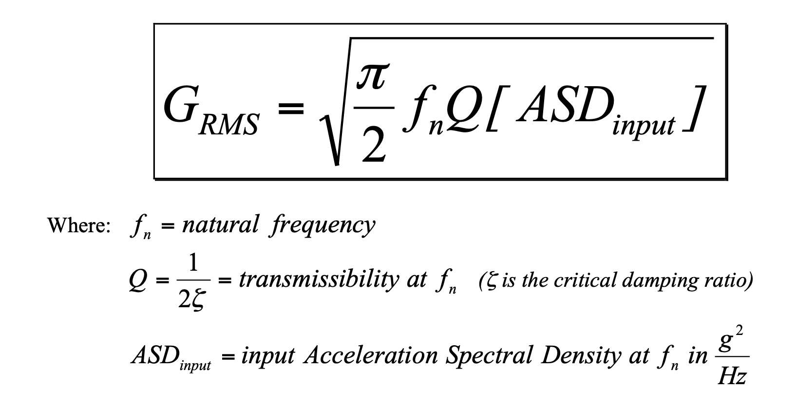

# Single Degree of Freedom

An undamped single degree of freedom system can be represented as

mx'' + kx = 0

The solution to this system is

x = cos(&omega;t)

Substituting

(-m*&omega;2 + k)*cos(&omega;t) = 0

Solving for &omega;

&omega; = sqrt(k/m)

The units would be in radians/s

# Multi Degree of Freedom

This can be expanded to matrices

Mx'' + Kx = 0

The solution is the same except that there are now multiple modes each with an
independent solution. Each mode has its own frequency and modeshape (the vector
of displacements of each degree of freedom). The magnitude of a modeshape is not
relevant. Whats important is the relative displacement for each degree of
freedom

Substituting the solution in gets you

(-M&omega;2 + K)\*u\*cos(&omega;t) = 0

If M and K are n x n matrices, there are n solutions to this problem. Each
solution &omega;i is a natural frequency of the system. Given a
solution &omega;i, a corresponding eigenvector can be found by
plugging in an eigenvalue and solving the system of equations for u. The
collection of eigenvectors can be formed into a matrix (n vectors of length n).
This eigenvector matrix &Phi; can be used to transform the solution between the
physical domain and the modal domain. The eigenvectors are typically scaled such
that modal mass equals 1

Subbing in x = &Phi;u and multiplying by &Phi;T we get

&Phi;TM&Phi;u'' + &Phi;TK&Phi;u = 0

where

&Phi;TM&Phi; = I

and

&Phi;TK&Phi; = &Omega;2 where &Omega;2 in this
case is a diagonal matrix of eigenvalues

Looking at this, using the mapping x = &Phi;u, you can go between the modal
domain and physical.

The natural frequencies of a problem are useful for a couple of reasons.

- If a natural frequency of a system is near an applied load frequency, you
  could see significant amplfication of motion. This can be analyzed by adding
  damping and a forcing function into the equations
- For a transient analysis of a problem, converting the problem to the modal
  domain and only taking modes in the frequency range of interest can
  significantly reduce the complexity of a problem which can greatly speed up
  analysis. Additionally, for transient analysis, the stability of a problem has
  to do with the highest eigenvalues of a particular problem. Higher eigenvalues
  lead to either needing a smaller time step or adding artificial damping either
  explicitly using a damping term or implicitly using an implicit solver.

# Modal Sensitivity

In a multi degree of freedom system, its sometimes important to determine what
the main contributor is to a particular mode. This information can be used if
the frequency of the mode needs to be changed for operation requirements or in
tuning a model to test data its useful to know which part of the model to
change. Often identifying the critical component to a mode isn't difficult to
identify, but it can be when it is a combination of multiple modes.

There are two ways to identify modal element contribution using a model: using
strain energy or making incremental changes to the stiffness matrix.

## Strain Energe

Check the strain energy for a given mode. This is an easy output to add for
NASTRAN (`ESE = ALL` in case control) and can show which elements in the model
are the biggest contributors for a given mode. It can be looked at in two ways:
Strain Energy and Strain Energy Density. Both of these can be useful for
different things.

- Strain Energy Density is useful to identify areas that have more strain than
  other areas. Though if its just a small section of the model, even if that
  section gets stiffened greatly, its unlikely to have a signficant effect on
  the mode and its frequency.
- Strain Energy can be used to identify where all the strain energy is for a
  given mode. This can also be viewed as percent strain energy. It can be useful
  to sum up strain energy for multiple adjacent elements or types of elements to
  see the percent strain energy for a particular section of the model. What
  you're looking for when trying to adjust a model to match something is the
  property that you can change that has the biggest effect on the mode that you
  want to change without significantly affecting other modes that you think are
  correct

## Incremental Stiffness Matrix Variation

This method typically requires a bit of scripting since you may end up running
many variations of a model, but is very effective once you have it set up.

If you apply a small increase across the whole stiffness matrix, you would get a
small increase in all the modal frequencies. The increase can be estimated by
doing a first order taylor series expansion of &Omega;2 = k/m. If you
do that, what you get is that for 1% increase in stiffness, you would expect a
0.5% in a modal frequency. (This would break down at larger increases in
stiffness but it is a good approximation for small increases in stiffness).

If we take that idea and apply it to individual components in a model and
individual modes, a 1% increase in stiffness to an individual component (or sets
of components) of a model and run the resulting model we can compare the change
in natural frequencies to estimate the contribution of that component. If a 1%
increase in a single component of a model causes a 0.5% increase in a certain
mode, that would indicate that that mode is currently entirely driven by the
changed stiffness in that component. On the other hand if instead, you only see
a 0.05% change in natural frequency then we can say that the stiffness of that
component comprises 10% of the variability of that modal frequency for the
current model.

This can be expanded to the entire model and all the modes if split up a model
into all of its components. If you run individual cases increasing the stiffness
of each component by 1% and total up the percent contributions across all the
modes, you should get approximate 100% contribution for each mode across all the
components. With that you have basically have a map to guide you on exactly
which knobs to turn if you want to make adjustments to a model.

> TODO Add code/example to show this

Note that a component in this case could be anything that contributes to the
stiffness of a model. It could be everything a model that uses a certain
material (in which case you would vary E/G), or it could be all beams that share
a property (in which case you may vary A/I1/I2/J) or it could be just a single
property of a single beam.

Its important to understand how the properties of a model influence the
stiffness of a model. If you increase a plate thickness by 1%, you actually
increase the tensile and shear stiffness by 1% but the bending stiffness of the
plate would increase by a factor 1.01^3. This would break the underlying
assumption in terms of calculating the influence of individual changes. For
components such as plates it tends to be easier to adjust the modulus of the
underlying material. If scripting this method, this can be done be creating new
materials and properties that are copies of existing ones and pointing only
particular plate elements to these new materials and properties. Then you can
adjust the modulus and not worry about needing to change the thickness

With that said, if you don't concern yourself too much with getting 100%
contributions for each mode and are only using it as a guide on which mode is
influenced by each component, its a bit less critical to make sure that you only
make the same 1% increase everywhere.

# Frequency Response

## Miles Equation

The Miles Equation is a closed form solution for calculating the rms response of
a single degree of freedom system subject to a uniform random excitation.

This is effectively the square root of the integration of the psd response
curve. This may seem like it has limited usefulness since you often aren't
working with a uniform excitation or a single degree of freedom system, but it
still is useful for estimating when those two assumptions aren't necessarily
true. For a lightly damped system, the result of the integration of the entire
curve from 0 to &infin; Hertz is very close to the integral of just the peak. So
the miles equation can provide a nice estimate for the rms response if the input
excitation is nearly constant in the range of the particular peak. Similarly for
a multi mode model, it can still be helpful because you may only be intersted in
a particular component of a model and its dominant response may only be at a
single frequency in which case the miles equation can give you a decent estimate
for the rms response.

The result of the miles equation is an rms g's response. This can be multiplied
by a stress at 1g for a component to get an rms stress. This is always an
estimate for a multi degree of freedom model where the stress due to 1g of load
would be driven by multiple modes typically, but it is a useful way to do a
quick estimate for the rms stress of a component due to random vibration.

[More Info](https://femci.gsfc.nasa.gov/workshop/2001/posters/simmons/Simmons_MilesEquation.pdf)

## Acoustic Loading

Acoustic loading is the load on a structure due to acoustic pressure waves. In
aircraft this is important for all engines, particularly propellers which
produce narrow band pressure waves at the frequency of number of propellers
times the rotation speed as well as harmonics (integer multiples).

The following paper is a deeper dive into the stress of
[STRESSES IN SKIN PANELS SUBJECTED TO "RANDOM ACOUSTIC LOADING"](https://apps.dtic.mil/dtic/tr/fulltext/u2/658846.pdf)

# Modal Testing

Good PDF overview [Modal Excitation](Modal%20Excitation%20Tutorial.pdf)
